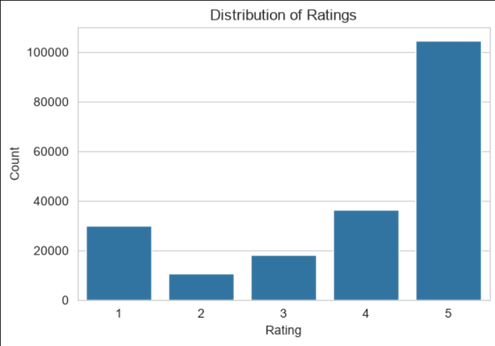
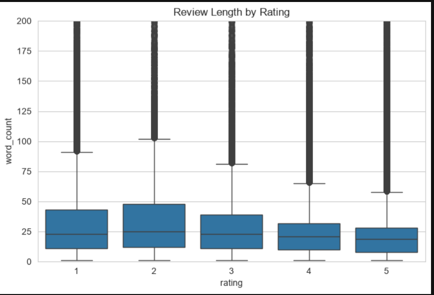
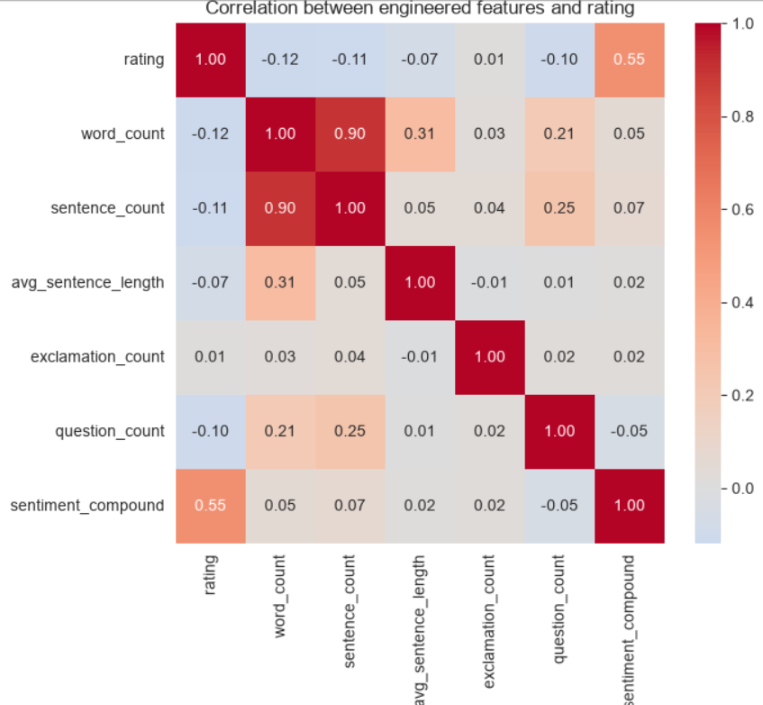
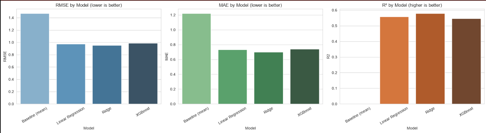
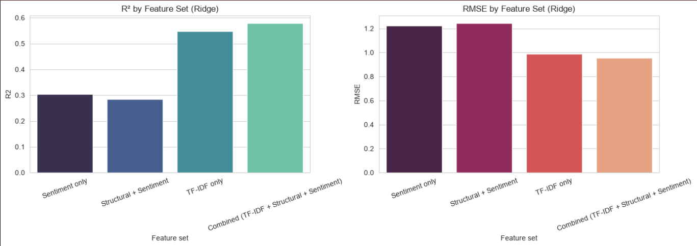
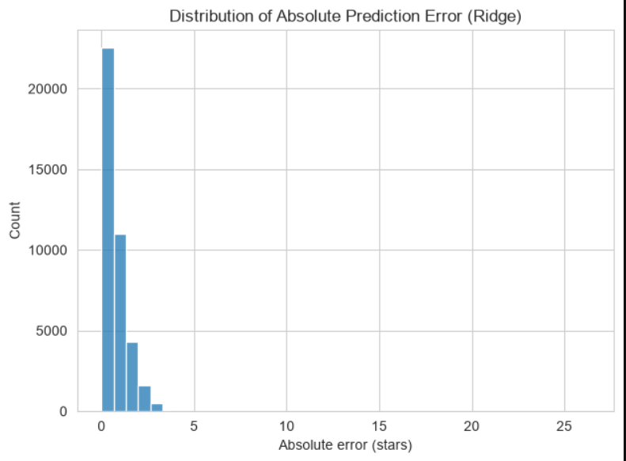
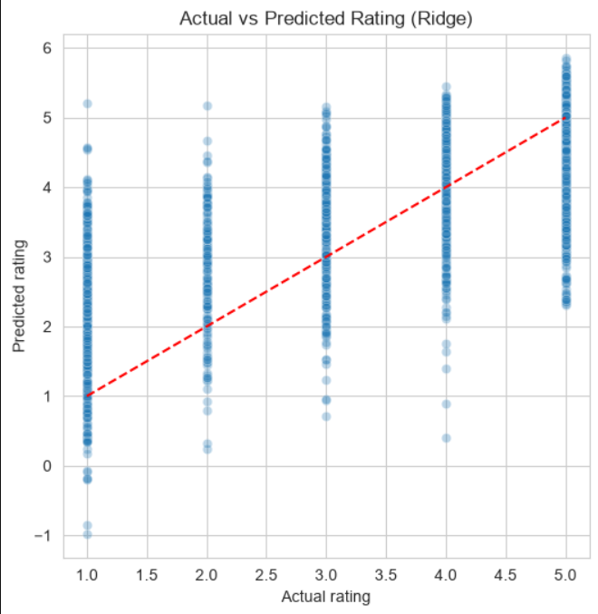
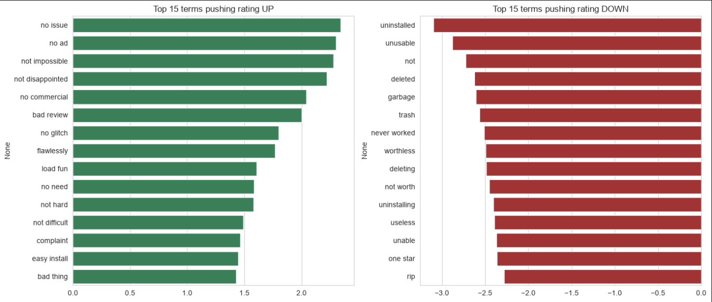

# Amazon Review Rating Predictor

Predicting the numeric star rating (1.0–5.0) of an Amazon review purely from its raw text, using TF-IDF, structural features, and sentiment analysis, compared across Linear Regression, Ridge, and XGBoost.

## Problem Statement

Content platforms and e-commerce sites want to understand how well a review's text content predicts its star rating — useful for flagging text/rating mismatches, auto-suggesting a rating, or understanding what language drives satisfaction. This project frames rating prediction as a **continuous regression problem** (not classification), since a 1–5 star scale is inherently ordinal: a 4-star and 5-star review are "closer" than a 1-star and 5-star review.

## Dataset

- **Source:** [Amazon Reviews 2023](https://huggingface.co/datasets/McAuley-Lab/Amazon-Reviews-2023) (McAuley Lab, Hugging Face)
- **Category:** Software
- **Size used:** 200,000 reviews, randomly sampled (preserving the real, skewed rating distribution) from ~4.12M cleaned reviews
- **Note:** The raw dataset file is not included in this repo due to size (~500MB+). Download it directly:
  ```bash
  curl -L -O "https://huggingface.co/datasets/McAuley-Lab/Amazon-Reviews-2023/resolve/main/raw/review_categories/Software.jsonl"
  ```

### Rating Distribution



The dataset is heavily skewed toward 5-star reviews (~52%), with 1-star reviews (~15%) more common than 2-star or 3-star — a typical bimodal pattern in review data, since people tend to leave reviews when they feel strongly (very happy or very unhappy) rather than when they're lukewarm.

## Approach

### 1. Data Cleaning
- Removed 324 blank/whitespace-only reviews
- Removed ~759K exact duplicate reviews (same text + rating, confirmed as genuine repeated content, not coincidental short phrases)
- Removed 7 reviews that consisted only of a bare URL
- Stripped HTML artifacts (`<br />`, `&#34;`) and URLs from review text

### 2. Feature Engineering

**Structural features:** word count, sentence count, average sentence length, exclamation mark count, question mark count
**Sentiment feature:** VADER compound sentiment score
**Text features:** TF-IDF with `ngram_range=(1,2)`, capped at 5,000 features, built on a normalized text version (lowercased, stopwords removed *except negation words* like "not"/"no"/"nor" to preserve sentiment-flipping phrases, lemmatized)

**Review length by rating:**



Median review length decreases fairly steadily from 1–2 star reviews (~23–25 words) down to 5-star reviews (~19 words) — reviewers leaving lower or mixed ratings tend to explain themselves in more detail, while positive reviewers often write short, generic praise.

**Feature correlation with rating:**



| Feature | Correlation with rating |
|---|---|
| sentiment_compound | **0.55** |
| word_count | -0.12 |
| sentence_count | -0.11 |
| question_count | -0.10 |
| avg_sentence_length | -0.07 |
| exclamation_count | 0.01 |

VADER sentiment is by far the strongest single engineered feature. Structural features correlate weakly but consistently negative — longer, more question-heavy reviews skew toward lower ratings — while exclamation marks carry essentially no standalone signal.

### 3. Models Compared
- Linear Regression (baseline linear model)
- Ridge Regression (regularized linear model)
- XGBoost (gradient boosting — used in place of LightGBM, which was blocked by a local Windows Application Control / Smart App Control policy)

All model predictions were clipped to the valid [1, 5] range before evaluation, since unconstrained regression can otherwise output out-of-range values for extreme inputs (e.g. reviews with unusually heavy punctuation).

## Results

### Model Comparison



| Model | RMSE | MAE | R² | RMSE Improvement vs. Baseline |
|---|---|---|---|---|
| Baseline (predict mean) | 1.469 | 1.220 | ~0.000 | — |
| Linear Regression | 0.976 | 0.734 | 0.558 | 33.6% |
| **Ridge Regression (best)** | **0.954** | **0.690** | **0.579** | **35.1%** |
| XGBoost | 0.989 | 0.734 | 0.547 | 32.7% |

**Ridge Regression was the best-performing model overall.** This is a genuine, explainable finding rather than a shortcoming of the boosting model: on very sparse, high-dimensional TF-IDF input, linear models exploit the additive relationship between individual word signals and rating more effectively than tree-based models, which split on one feature at a time.

### Feature Ablation Study



To isolate how much each feature group actually contributes, Ridge was retrained separately on each subset:

| Feature Set | RMSE | R² |
|---|---|---|
| Sentiment only (VADER) | 1.225 | 0.305 |
| Structural + Sentiment | 1.243 | 0.284 |
| TF-IDF only | 0.988 | 0.547 |
| **Combined (TF-IDF + Structural + Sentiment)** | **0.954** | **0.579** |

**Key finding:** TF-IDF text content alone explains the large majority of the achievable signal (R² = 0.547), while sentiment alone only reaches R² = 0.305. Structural features add essentially no standalone value and slightly *reduce* performance when combined with sentiment alone — but combining all three feature groups still yields a measurable improvement (R² 0.547 → 0.579) over TF-IDF alone, confirming sentiment and structural cues carry complementary, if secondary, signal.

### Error Analysis

**Error distribution:**



The large majority of predictions fall within 1 star of the true rating, with a small tail of larger misses beyond 2–3 stars.

**Actual vs. predicted:**



Predictions track the true rating directionally (visible upward trend along the diagonal), but with considerable spread at every rating level — reflecting the real ceiling on this task: two reviewers can write similarly-toned reviews and still rate differently based on factors outside the text entirely.

**Recurring error patterns identified on manual inspection of the worst predictions:**
- **Sarcasm / mixed sentiment** — text that reads as positive but carries a low rating, or vice versa
- **Very short reviews** — a two- or three-word review gives TF-IDF and structural features little to work with, so predictions regress toward the mean
- **Long, mixed-verdict reviews** — e.g. "loved the product but returned it because of X" — the model tends to average positive and negative language rather than correctly weighting the final verdict

These are inherent limitations of a bag-of-words + engineered-feature approach rather than implementation issues; a fine-tuned transformer model (e.g. BERT) would be the natural next step to address them.

### Feature Importance (Ridge coefficients)



Since Ridge is linear, its coefficients directly show which terms push predictions up or down:

| Pushes rating **up** | Pushes rating **down** |
|---|---|
| no issue, no ad, not disappointed, no commercial | uninstalled, unusable, deleted, garbage |
| no glitch, flawlessly, load fun | trash, never worked, worthless |
| no need, not hard, not difficult, easy install | deleting, not worth, uninstalling, useless |

Two things worth noting: negation-aware phrases like *"not disappointed"* and *"no issue"* dominate the positive side, confirming the earlier decision to keep negation words (`not`, `no`, `nor`) out of the stopword list was correct — removing them would have collapsed these into misleadingly negative single words. On the negative side, uninstallation-related and outright dismissive terms ("garbage," "trash," "worthless") are the strongest downward signals — direct product-failure language rather than mild criticism.

## Tech Stack

Python · pandas · NumPy · scikit-learn · XGBoost · NLTK · VADER Sentiment · Matplotlib · Seaborn

## How to Run

1. Clone this repo and install dependencies:
   ```bash
   pip install -r requirements.txt
   ```
2. Download the dataset (see [Dataset](#dataset) above) into the project root.
3. Open and run `amazon_review_rating_predictor.ipynb` top to bottom.

## Project Structure

```
amazon-review-rating-predictor/
├── amazon_review_rating_predictor.ipynb   # Full pipeline: cleaning, EDA, features, models, ablation, error analysis
├── images/                                # Saved plots referenced in this README
├── README.md
├── requirements.txt
└── .gitignore
```

## Key Takeaways

- Star rating prediction from text alone is a well-posed regression problem — unlike engagement/popularity prediction, which is largely driven by factors outside the text, rating is causally linked to review content, yielding a real, learnable signal (R² ≈ 0.58).
- Simple, well-regularized linear models can outperform gradient boosting on sparse, high-dimensional TF-IDF representations — model complexity is not automatically an advantage.
- Ablation studies are essential for making defensible claims about *why* a model performs well, rather than reporting a single aggregate metric.
- Negation-aware text preprocessing (keeping "not"/"no"/"nor" out of the stopword list) materially changes which phrases surface as top predictive features.

## Possible Extensions

- Fine-tune a transformer (e.g. DistilBERT) to address the sarcasm/mixed-sentiment error cases identified above
- Extend to multiple Amazon categories to test generalization
- Incorporate `verified_purchase` and review recency as additional structural features

